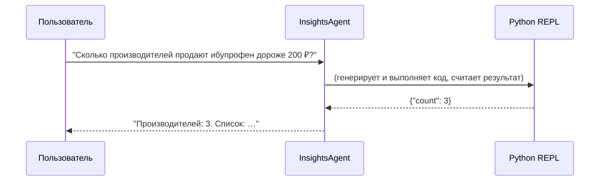

```markdown
# AGENTS.md  
Документация по архитектуре агентов для проекта **Pharma Price Parser**

## 1. Общая схема

```

┌───────────────────┐        ┌──────────────────────┐        ┌────────────────────────┐
│   CSV-ридер       │──URLs──▶  **IngestionAgent**  │──DF──▶  **InsightsAgent**      │
│  (pandas)         │        │  (LangChain + LLM)   │        │  (LangChain + LLM)     │
└───────────────────┘        └──────────────────────┘        └────────────────────────┘

````

* **IngestionAgent** ― извлекает и нормализует данные из HTML-страниц.  
* **InsightsAgent** ― даёт аналитические выводы по DataFrame на пользовательский запрос.  

Обе цепочки построены с помощью **LangChain 0.2+** и **OpenAI Chat Completions API**.

---

## 2. IngestionAgent

| Параметр                | Значение                                                                                           |
|-------------------------|-----------------------------------------------------------------------------------------------------|
| **Задача (role)**       | «Извлеки `sku`, `manufacturer`, `price` из переданного HTML-текста фарм-товара и верни JSON.»       |
| **LLM**                 | `ChatOpenAI(model_name="gpt-4o-mini", temperature=0.0)`                                            |
| **Инструменты**         | * Requests + BeautifulSoup для скачивания и очистки DOM<br>* LangChain `Tool` «python_repl» для post-processing |
| **Память**              | Отсутствует (stateless)                                                                             |
| **Вывод**               | `StructuredOutputParser` → `{"sku": str, "manufacturer": str, "price": float}`                     |
| **Ошибки / ретраи**     | LangChain `RetryWithErrorHandler`, максимум 3 повтора, экспоненциальный back-off                    |

### Prompt-template

```jinja2
Ты — эксперт-фармацевт и веб-скрейпер.
Проанализируй HTML-контент страницы и верни JSON строго следующего вида:
{
  "sku": "<полное название товара без формы выпуска>",
  "manufacturer": "<производитель>",
  "price": <цена в числовом виде без валюты>
}

<HTML>{{ html_text }}</HTML>

Только JSON, без комментариев.
````

### Поток работы

1. Чтение `urls.csv` (`pandas.read_csv`).
2. Для каждой ссылки:
   a. `requests.get(url, timeout=15)` → `response.text`
   b. `BeautifulSoup(response.text, "lxml").get_text(" ", strip=True)`
   c. LLM-вызов с prompt-template → JSON.
3. Собираем список словарей → `pandas.DataFrame(columns=["sku","manufacturer","price"])`.
4. Сохраняем `df.to_parquet("prices.parquet")` (atomic write).

---

## 3. InsightsAgent

| Параметр          | Значение                                                                                                                                                 |
| ----------------- | -------------------------------------------------------------------------------------------------------------------------------------------------------- |
| **Задача (role)** | «Отвечай на аналитические вопросы, используя DataFrame с колонками `sku`, `manufacturer`, `price`. При необходимости пиши код на Python и исполняй его.» |
| **LLM**           | `ChatOpenAI(model_name="gpt-4o-mini", temperature=0.2)`                                                                                                  |
| **Инструменты**   | \* LangChain `PythonAstREPLTool` с контекстом, содержащим загруженный DataFrame (`df`)                                                                   |
| **Память**        | ConversationBufferMemory (чтобы помнить предыдущие вопросы-ответы)                                                                                       |
| **Вывод**         | Текстовое объяснение + (опционально) табличный/графический результат, сгенерированный кодом                                                              |

### Prompt-template (сокращённая)

````jinja2
Ты — фармацевт-аналитик данных.
Тебе доступен объект pandas DataFrame `df` со столбцами sku, manufacturer, price.
Отвечай на вопрос пользователя, применяя код Python внутри текстовых блоков ```python ... ```
Если код что-то выводит (таблицу или график), покажи результат пользователю.
В конце — краткий вывод.

Вопрос: {{ user_question }}
````

LangChain автоматически интерпретирует блоки `python` через `PythonAstREPLTool`, а текст возвращает пользователю.

---

## 4. Последовательность вызовов



---

## 5. Переменные окружения

| Переменная       | Описание                                   | Пример                  |
| ---------------- | ------------------------------------------ | ----------------------- |
| `OPENAI_API_KEY` | ключ доступа к OpenAI Chat Completions API | `sk-...`                |
| `PROXY` *(опц.)* | прокси для outbound HTTP                   | `http://127.0.0.1:8080` |

---

## 6. Минимальный пример запуска

```bash
python -m venv .venv && source .venv/bin/activate
pip install -U langchain openai pandas beautifulsoup4 lxml requests pyarrow
export OPENAI_API_KEY="sk-…"
python run_pipeline.py --csv urls.csv --question "Средняя цена по производителям?"
```

`run_pipeline.py`:

```python
from agents import ingest_prices, ask_insights
df = ingest_prices("urls.csv")
print(df.head())
answer = ask_insights(df, "Средняя цена по производителям?")
print(answer)
```

---

## 7. Расширение

* **Кэширование**: добавить `langchain.cache` для повторных запросов к тем же URL.
* **Асинхронный парсинг**: использовать `aiohttp` + `anyio` для увеличения пропускной способности.
* **Доп. поля**: dosage\_form, volume, currency, updated\_at.
* **Fine-tuning**: обучить модель-помощник на собственных примерах фарм-страниц для лучшей точности.

---

## 8. Лицензия

MIT. Полный текст см. в `LICENSE`.

```
```
